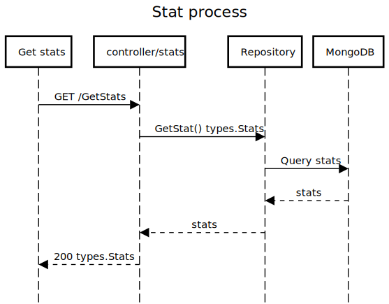

# mutant-go
go project

## 1. Instalación.

Para correr este proyecto necesitas tener instalado Docker, ya que el ambiente de desarrollo está configurado con dicha herramienta.

### 2. Instalación (MacOS, windows y linux).

Compilar la imagen de Docker y levantarla con los siguientes pasos.

Compilar
```sh
$ docker build -f docker/dev/Dockerfile -t test.com/mutant-go:dev .
```

Correr
```sh
$ docker run --rm -it \
	-p 4000:4001 \
	-v ${PWD}/cmd:/app/cmd \
	-v ${PWD}/application:/app/application \
	--env-file ./.env \
	test.com/mutant-go:dev
```

## 3. Configuración del entorno.

El proyecto usa las siguientes variables de entorno:

`Solicitar archivo .env`

Ejemplo del archivo .env
```sh
PORT=":4000"
ALLOW_URL="http://localhost:4000;http://localhost:4001"
DB_URL= // url de la DB con secretos
```

### 4. Ejecución de tests.

Para ejecutar los tests correr

```sh
$ go test ./... -cover
```

### 4. End-points.
GET http://{URL}/stats


POST http://{URL}/mutant
```sh
payload
{
    "dna": [
        "ATGCGA",
        "CAGTGC",
        "TTATGT",
        "AGAAGG",
        "CCCCTA",
        "TCACTC"
    ]
}
```


### 5. Diagrama de secuencia.
<p align="center"></p>
<p align="center"></p>

### 6. Diagrama de arquitectura.
<p align="center"></p>