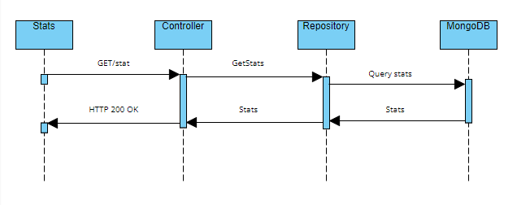

# mutant-go
go project

### 1. Configuración del entorno.

El proyecto usa las siguientes variables de entorno:

`Solicitar archivo .env`

Ejemplo del archivo .env
```sh
PORT=":4000"
DB_URL= // url de la DB con secretos
```

### 2. Iniciar API desde el host.

Iniciar la aplicacion en modo desarrollo:

```sh
go run .
```

La aplicacion deberia iniciar en el puerto 4000 o cualquier otro indicado por el archivo .env

### 3. Ejecución de tests.

Para ejecutar los tests correr

```sh
$ go test ./... -cover
```

### 4. End-points.
GET http://{URL}/stats


POST http://{URL}/mutant
```sh
payload
{
    "dna": [
        "ATGCGA",
        "CAGTGC",
        "TTATGT",
        "AGAAGG",
        "CCCCTA",
        "TCACTC"
    ]
}
```

### 5. Diagrama de secuencia.
<p align="center"></p>
<p align="center"></p>

### 6. Diagrama de arquitectura.
<p align="center"></p>